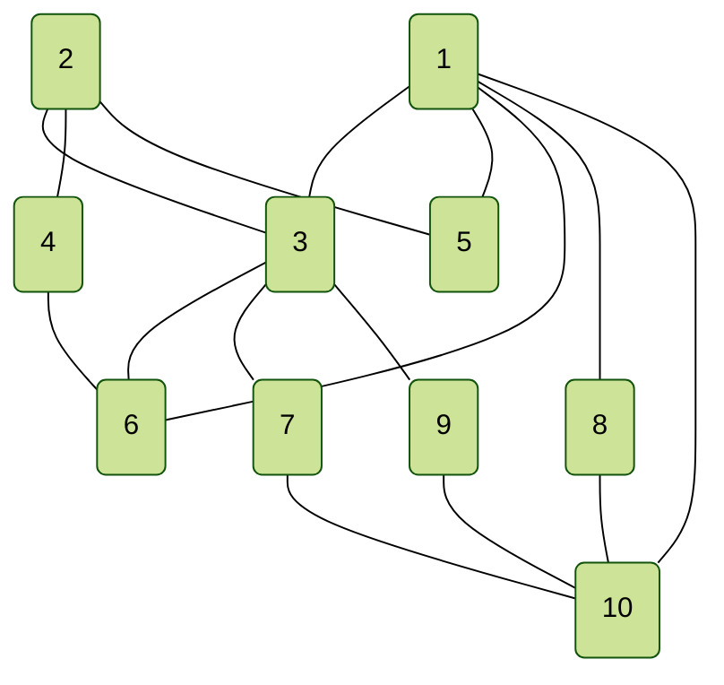
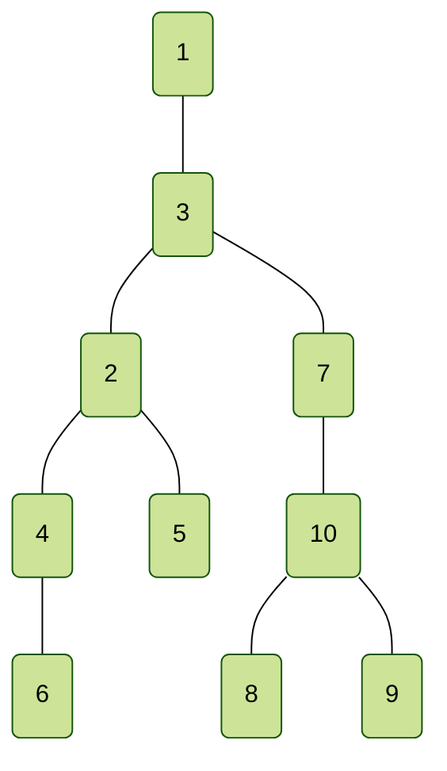
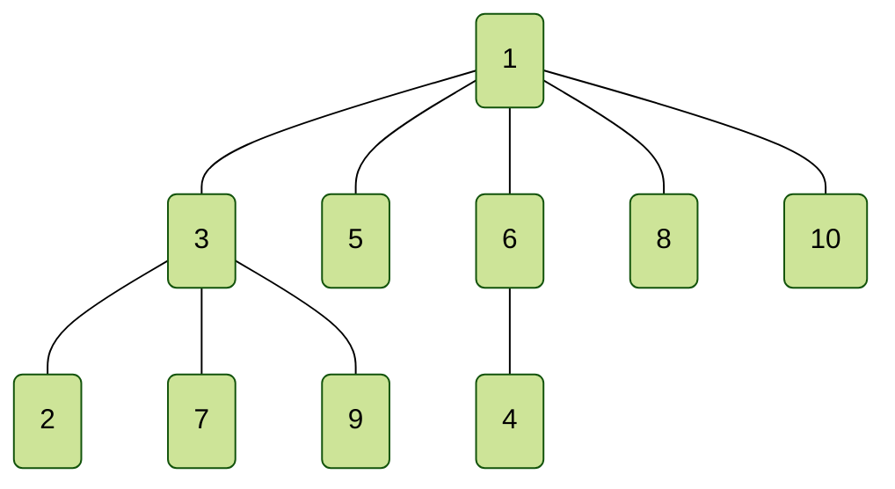

The program will Generate random undirected graph and runs DFS & BFS, output Adjacency Matrix and Adjacency List for the graph and both DFS, BFS tree, output will be show in command line and also 3 markdown files `graaph.md`, `DFS.md`, `BFS.md` for better view, and also 3 `csv` file for generating NodeXL/cytoscape graph view.
The 3 markdown files are include in the report attachment, and file output result have already been paste to this report along with the command line output. 
# 1. Random Graph Generate
n = 10, e = 15
![[Pasted image 20230504104111.png]]
command line output result, the random edges generated (from <1,3> to <9,10>)
![[Pasted image 20230504104228.png]]
markdown file export graph and edges show as below
<1,3> <1,5> <1,6> <1,8> <1,10> <2,3> <2,4> <2,5> <3,6> <3,7> <3,9> <4,6> <7,10> <8,10> <9,10> 

The graph rendered by cytoscape (mac), laptop isn't window system
![[Pasted image 20230504104605.png]]
### Adjacent List
command line output :
![[Pasted image 20230504104859.png]]
markdown file output : 
<table style="border-collapse: collapse;">
	<tr>
<th style="width: 25px; color: black">[1]</th>		<th style="border: 2px solid #000000; width: 25px; color: black"></th>
		<th style="color: black">→</th>
		<th style="border: 2px solid #000000; width: 25px; color: black">3</th>
		<th style="border: 2px solid #000000; width: 25px; color: black"></th>
		<th style="color: black">→</th>
		<th style="border: 2px solid #000000; width: 25px; color: black">5</th>
		<th style="border: 2px solid #000000; width: 25px; color: black"></th>
		<th style="color: black">→</th>
		<th style="border: 2px solid #000000; width: 25px; color: black">6</th>
		<th style="border: 2px solid #000000; width: 25px; color: black"></th>
		<th style="color: black">→</th>
		<th style="border: 2px solid #000000; width: 25px; color: black">8</th>
		<th style="border: 2px solid #000000; width: 25px; color: black"></th>
		<th style="color: black">→</th>
		<th style="border: 2px solid #000000; width: 25px; color: black">10</th>
		<th style="border: 2px solid #000000; width: 25px; color: black"></th>
</tr>
	<tr>
<th style="width: 25px; color: black">[2]</th>		<th style="border: 2px solid #000000; width: 25px; color: black"></th>
		<th style="color: black">→</th>
		<th style="border: 2px solid #000000; width: 25px; color: black">3</th>
		<th style="border: 2px solid #000000; width: 25px; color: black"></th>
		<th style="color: black">→</th>
		<th style="border: 2px solid #000000; width: 25px; color: black">4</th>
		<th style="border: 2px solid #000000; width: 25px; color: black"></th>
		<th style="color: black">→</th>
		<th style="border: 2px solid #000000; width: 25px; color: black">5</th>
		<th style="border: 2px solid #000000; width: 25px; color: black"></th>
</tr>
	<tr>
<th style="width: 25px; color: black">[3]</th>		<th style="border: 2px solid #000000; width: 25px; color: black"></th>
		<th style="color: black">→</th>
		<th style="border: 2px solid #000000; width: 25px; color: black">1</th>
		<th style="border: 2px solid #000000; width: 25px; color: black"></th>
		<th style="color: black">→</th>
		<th style="border: 2px solid #000000; width: 25px; color: black">2</th>
		<th style="border: 2px solid #000000; width: 25px; color: black"></th>
		<th style="color: black">→</th>
		<th style="border: 2px solid #000000; width: 25px; color: black">6</th>
		<th style="border: 2px solid #000000; width: 25px; color: black"></th>
		<th style="color: black">→</th>
		<th style="border: 2px solid #000000; width: 25px; color: black">7</th>
		<th style="border: 2px solid #000000; width: 25px; color: black"></th>
		<th style="color: black">→</th>
		<th style="border: 2px solid #000000; width: 25px; color: black">9</th>
		<th style="border: 2px solid #000000; width: 25px; color: black"></th>
</tr>
	<tr>
<th style="width: 25px; color: black">[4]</th>		<th style="border: 2px solid #000000; width: 25px; color: black"></th>
		<th style="color: black">→</th>
		<th style="border: 2px solid #000000; width: 25px; color: black">2</th>
		<th style="border: 2px solid #000000; width: 25px; color: black"></th>
		<th style="color: black">→</th>
		<th style="border: 2px solid #000000; width: 25px; color: black">6</th>
		<th style="border: 2px solid #000000; width: 25px; color: black"></th>
</tr>
	<tr>
<th style="width: 25px; color: black">[5]</th>		<th style="border: 2px solid #000000; width: 25px; color: black"></th>
		<th style="color: black">→</th>
		<th style="border: 2px solid #000000; width: 25px; color: black">1</th>
		<th style="border: 2px solid #000000; width: 25px; color: black"></th>
		<th style="color: black">→</th>
		<th style="border: 2px solid #000000; width: 25px; color: black">2</th>
		<th style="border: 2px solid #000000; width: 25px; color: black"></th>
</tr>
	<tr>
<th style="width: 25px; color: black">[6]</th>		<th style="border: 2px solid #000000; width: 25px; color: black"></th>
		<th style="color: black">→</th>
		<th style="border: 2px solid #000000; width: 25px; color: black">1</th>
		<th style="border: 2px solid #000000; width: 25px; color: black"></th>
		<th style="color: black">→</th>
		<th style="border: 2px solid #000000; width: 25px; color: black">3</th>
		<th style="border: 2px solid #000000; width: 25px; color: black"></th>
		<th style="color: black">→</th>
		<th style="border: 2px solid #000000; width: 25px; color: black">4</th>
		<th style="border: 2px solid #000000; width: 25px; color: black"></th>
</tr>
	<tr>
<th style="width: 25px; color: black">[7]</th>		<th style="border: 2px solid #000000; width: 25px; color: black"></th>
		<th style="color: black">→</th>
		<th style="border: 2px solid #000000; width: 25px; color: black">3</th>
		<th style="border: 2px solid #000000; width: 25px; color: black"></th>
		<th style="color: black">→</th>
		<th style="border: 2px solid #000000; width: 25px; color: black">10</th>
		<th style="border: 2px solid #000000; width: 25px; color: black"></th>
</tr>
	<tr>
<th style="width: 25px; color: black">[8]</th>		<th style="border: 2px solid #000000; width: 25px; color: black"></th>
		<th style="color: black">→</th>
		<th style="border: 2px solid #000000; width: 25px; color: black">1</th>
		<th style="border: 2px solid #000000; width: 25px; color: black"></th>
		<th style="color: black">→</th>
		<th style="border: 2px solid #000000; width: 25px; color: black">10</th>
		<th style="border: 2px solid #000000; width: 25px; color: black"></th>
</tr>
	<tr>
<th style="width: 25px; color: black">[9]</th>		<th style="border: 2px solid #000000; width: 25px; color: black"></th>
		<th style="color: black">→</th>
		<th style="border: 2px solid #000000; width: 25px; color: black">3</th>
		<th style="border: 2px solid #000000; width: 25px; color: black"></th>
		<th style="color: black">→</th>
		<th style="border: 2px solid #000000; width: 25px; color: black">10</th>
		<th style="border: 2px solid #000000; width: 25px; color: black"></th>
</tr>
	<tr>
<th style="width: 25px; color: black">[10]</th>		<th style="border: 2px solid #000000; width: 25px; color: black"></th>
		<th style="color: black">→</th>
		<th style="border: 2px solid #000000; width: 25px; color: black">1</th>
		<th style="border: 2px solid #000000; width: 25px; color: black"></th>
		<th style="color: black">→</th>
		<th style="border: 2px solid #000000; width: 25px; color: black">7</th>
		<th style="border: 2px solid #000000; width: 25px; color: black"></th>
		<th style="color: black">→</th>
		<th style="border: 2px solid #000000; width: 25px; color: black">8</th>
		<th style="border: 2px solid #000000; width: 25px; color: black"></th>
		<th style="color: black">→</th>
		<th style="border: 2px solid #000000; width: 25px; color: black">9</th>
		<th style="border: 2px solid #000000; width: 25px; color: black"></th>
</tr>
</table>

### Adjacent Matrix
command line output :
![[Pasted image 20230504104951.png]]
markdown file output : 
$$\begin {array} {cc}
\begin {matrix}
& 1& 2& 3& 4& 5& 6& 7& 8& 9& 10
\end {matrix} \\
\begin {matrix}
1 \\2 \\3 \\4 \\5 \\6 \\7 \\8 \\9 \\10 \\
\end {matrix}
\begin {bmatrix}
0 & 0 & 1 & 0 & 1 & 1 & 0 & 1 & 0 & 1 \\
0 & 0 & 1 & 1 & 1 & 0 & 0 & 0 & 0 & 0 \\
1 & 1 & 0 & 0 & 0 & 1 & 1 & 0 & 1 & 0 \\
0 & 1 & 0 & 0 & 0 & 1 & 0 & 0 & 0 & 0 \\
1 & 1 & 0 & 0 & 0 & 0 & 0 & 0 & 0 & 0 \\
1 & 0 & 1 & 1 & 0 & 0 & 0 & 0 & 0 & 0 \\
0 & 0 & 1 & 0 & 0 & 0 & 0 & 0 & 0 & 1 \\
1 & 0 & 0 & 0 & 0 & 0 & 0 & 0 & 0 & 1 \\
0 & 0 & 1 & 0 & 0 & 0 & 0 & 0 & 0 & 1 \\
1 & 0 & 0 & 0 & 0 & 0 & 1 & 1 & 1 & 0 \\
\end {bmatrix}
\end{array}$$

# 2. (1) DFS
![[Pasted image 20230504105049.png]]
markdown file export graph and edges show as below
<1,3> <3,2> <2,4> <4,6> <2,5> <3,7> <7,10> <10,8> <10,9> 

graph rendered by cytoscape (mac)
![[Pasted image 20230504105326.png]]
### Adjacent List
command line output :
![[Pasted image 20230504105510.png]]
markdown file output : 
<table style="border-collapse: collapse;">
	<tr>
<th style="width: 25px; color: black">[1]</th>		<th style="border: 2px solid #000000; width: 25px; color: black"></th>
		<th style="color: black">→</th>
		<th style="border: 2px solid #000000; width: 25px; color: black">3</th>
		<th style="border: 2px solid #000000; width: 25px; color: black"></th>
</tr>
	<tr>
<th style="width: 25px; color: black">[2]</th>		<th style="border: 2px solid #000000; width: 25px; color: black"></th>
		<th style="color: black">→</th>
		<th style="border: 2px solid #000000; width: 25px; color: black">3</th>
		<th style="border: 2px solid #000000; width: 25px; color: black"></th>
		<th style="color: black">→</th>
		<th style="border: 2px solid #000000; width: 25px; color: black">4</th>
		<th style="border: 2px solid #000000; width: 25px; color: black"></th>
		<th style="color: black">→</th>
		<th style="border: 2px solid #000000; width: 25px; color: black">5</th>
		<th style="border: 2px solid #000000; width: 25px; color: black"></th>
</tr>
	<tr>
<th style="width: 25px; color: black">[3]</th>		<th style="border: 2px solid #000000; width: 25px; color: black"></th>
		<th style="color: black">→</th>
		<th style="border: 2px solid #000000; width: 25px; color: black">1</th>
		<th style="border: 2px solid #000000; width: 25px; color: black"></th>
		<th style="color: black">→</th>
		<th style="border: 2px solid #000000; width: 25px; color: black">2</th>
		<th style="border: 2px solid #000000; width: 25px; color: black"></th>
		<th style="color: black">→</th>
		<th style="border: 2px solid #000000; width: 25px; color: black">7</th>
		<th style="border: 2px solid #000000; width: 25px; color: black"></th>
</tr>
	<tr>
<th style="width: 25px; color: black">[4]</th>		<th style="border: 2px solid #000000; width: 25px; color: black"></th>
		<th style="color: black">→</th>
		<th style="border: 2px solid #000000; width: 25px; color: black">2</th>
		<th style="border: 2px solid #000000; width: 25px; color: black"></th>
		<th style="color: black">→</th>
		<th style="border: 2px solid #000000; width: 25px; color: black">6</th>
		<th style="border: 2px solid #000000; width: 25px; color: black"></th>
</tr>
	<tr>
<th style="width: 25px; color: black">[5]</th>		<th style="border: 2px solid #000000; width: 25px; color: black"></th>
		<th style="color: black">→</th>
		<th style="border: 2px solid #000000; width: 25px; color: black">2</th>
		<th style="border: 2px solid #000000; width: 25px; color: black"></th>
</tr>
	<tr>
<th style="width: 25px; color: black">[6]</th>		<th style="border: 2px solid #000000; width: 25px; color: black"></th>
		<th style="color: black">→</th>
		<th style="border: 2px solid #000000; width: 25px; color: black">4</th>
		<th style="border: 2px solid #000000; width: 25px; color: black"></th>
</tr>
	<tr>
<th style="width: 25px; color: black">[7]</th>		<th style="border: 2px solid #000000; width: 25px; color: black"></th>
		<th style="color: black">→</th>
		<th style="border: 2px solid #000000; width: 25px; color: black">3</th>
		<th style="border: 2px solid #000000; width: 25px; color: black"></th>
		<th style="color: black">→</th>
		<th style="border: 2px solid #000000; width: 25px; color: black">10</th>
		<th style="border: 2px solid #000000; width: 25px; color: black"></th>
</tr>
	<tr>
<th style="width: 25px; color: black">[8]</th>		<th style="border: 2px solid #000000; width: 25px; color: black"></th>
		<th style="color: black">→</th>
		<th style="border: 2px solid #000000; width: 25px; color: black">10</th>
		<th style="border: 2px solid #000000; width: 25px; color: black"></th>
</tr>
	<tr>
<th style="width: 25px; color: black">[9]</th>		<th style="border: 2px solid #000000; width: 25px; color: black"></th>
		<th style="color: black">→</th>
		<th style="border: 2px solid #000000; width: 25px; color: black">10</th>
		<th style="border: 2px solid #000000; width: 25px; color: black"></th>
</tr>
	<tr>
<th style="width: 25px; color: black">[10]</th>		<th style="border: 2px solid #000000; width: 25px; color: black"></th>
		<th style="color: black">→</th>
		<th style="border: 2px solid #000000; width: 25px; color: black">7</th>
		<th style="border: 2px solid #000000; width: 25px; color: black"></th>
		<th style="color: black">→</th>
		<th style="border: 2px solid #000000; width: 25px; color: black">8</th>
		<th style="border: 2px solid #000000; width: 25px; color: black"></th>
		<th style="color: black">→</th>
		<th style="border: 2px solid #000000; width: 25px; color: black">9</th>
		<th style="border: 2px solid #000000; width: 25px; color: black"></th>
</tr>
</table>

### Adjacent Matrix
command line output :
![[Pasted image 20230504105602.png]]
markdown file output : 
$$\begin {array} {cc}
\begin {matrix}
& 1& 2& 3& 4& 5& 6& 7& 8& 9& 10
\end {matrix} \\
\begin {matrix}
1 \\2 \\3 \\4 \\5 \\6 \\7 \\8 \\9 \\10 \\
\end {matrix}
\begin {bmatrix}
0 & 0 & 1 & 0 & 0 & 0 & 0 & 0 & 0 & 0 \\
0 & 0 & 1 & 1 & 1 & 0 & 0 & 0 & 0 & 0 \\
1 & 1 & 0 & 0 & 0 & 0 & 1 & 0 & 0 & 0 \\
0 & 1 & 0 & 0 & 0 & 1 & 0 & 0 & 0 & 0 \\
0 & 1 & 0 & 0 & 0 & 0 & 0 & 0 & 0 & 0 \\
0 & 0 & 0 & 1 & 0 & 0 & 0 & 0 & 0 & 0 \\
0 & 0 & 1 & 0 & 0 & 0 & 0 & 0 & 0 & 1 \\
0 & 0 & 0 & 0 & 0 & 0 & 0 & 0 & 0 & 1 \\
0 & 0 & 0 & 0 & 0 & 0 & 0 & 0 & 0 & 1 \\
0 & 0 & 0 & 0 & 0 & 0 & 1 & 1 & 1 & 0 \\
\end {bmatrix}
\end{array}$$

# 2. (2) BFS
![[Pasted image 20230504105714.png]]
markdown file export graph and edges show as below
<1,3> <1,5> <1,6> <1,8> <1,10> <3,2> <3,7> <3,9> <6,4> 

graph rendered by cytoscape (mac)
![[Pasted image 20230504105852.png]]
### Adjacent List
command line output :
![[Pasted image 20230504105951.png]]
markdown file output : 
<table style="border-collapse: collapse;">
	<tr>
<th style="width: 25px; color: black">[1]</th>		<th style="border: 2px solid #000000; width: 25px; color: black"></th>
		<th style="color: black">→</th>
		<th style="border: 2px solid #000000; width: 25px; color: black">3</th>
		<th style="border: 2px solid #000000; width: 25px; color: black"></th>
		<th style="color: black">→</th>
		<th style="border: 2px solid #000000; width: 25px; color: black">5</th>
		<th style="border: 2px solid #000000; width: 25px; color: black"></th>
		<th style="color: black">→</th>
		<th style="border: 2px solid #000000; width: 25px; color: black">6</th>
		<th style="border: 2px solid #000000; width: 25px; color: black"></th>
		<th style="color: black">→</th>
		<th style="border: 2px solid #000000; width: 25px; color: black">8</th>
		<th style="border: 2px solid #000000; width: 25px; color: black"></th>
		<th style="color: black">→</th>
		<th style="border: 2px solid #000000; width: 25px; color: black">10</th>
		<th style="border: 2px solid #000000; width: 25px; color: black"></th>
</tr>
	<tr>
<th style="width: 25px; color: black">[2]</th>		<th style="border: 2px solid #000000; width: 25px; color: black"></th>
		<th style="color: black">→</th>
		<th style="border: 2px solid #000000; width: 25px; color: black">3</th>
		<th style="border: 2px solid #000000; width: 25px; color: black"></th>
</tr>
	<tr>
<th style="width: 25px; color: black">[3]</th>		<th style="border: 2px solid #000000; width: 25px; color: black"></th>
		<th style="color: black">→</th>
		<th style="border: 2px solid #000000; width: 25px; color: black">1</th>
		<th style="border: 2px solid #000000; width: 25px; color: black"></th>
		<th style="color: black">→</th>
		<th style="border: 2px solid #000000; width: 25px; color: black">2</th>
		<th style="border: 2px solid #000000; width: 25px; color: black"></th>
		<th style="color: black">→</th>
		<th style="border: 2px solid #000000; width: 25px; color: black">7</th>
		<th style="border: 2px solid #000000; width: 25px; color: black"></th>
		<th style="color: black">→</th>
		<th style="border: 2px solid #000000; width: 25px; color: black">9</th>
		<th style="border: 2px solid #000000; width: 25px; color: black"></th>
</tr>
	<tr>
<th style="width: 25px; color: black">[4]</th>		<th style="border: 2px solid #000000; width: 25px; color: black"></th>
		<th style="color: black">→</th>
		<th style="border: 2px solid #000000; width: 25px; color: black">6</th>
		<th style="border: 2px solid #000000; width: 25px; color: black"></th>
</tr>
	<tr>
<th style="width: 25px; color: black">[5]</th>		<th style="border: 2px solid #000000; width: 25px; color: black"></th>
		<th style="color: black">→</th>
		<th style="border: 2px solid #000000; width: 25px; color: black">1</th>
		<th style="border: 2px solid #000000; width: 25px; color: black"></th>
</tr>
	<tr>
<th style="width: 25px; color: black">[6]</th>		<th style="border: 2px solid #000000; width: 25px; color: black"></th>
		<th style="color: black">→</th>
		<th style="border: 2px solid #000000; width: 25px; color: black">1</th>
		<th style="border: 2px solid #000000; width: 25px; color: black"></th>
		<th style="color: black">→</th>
		<th style="border: 2px solid #000000; width: 25px; color: black">4</th>
		<th style="border: 2px solid #000000; width: 25px; color: black"></th>
</tr>
	<tr>
<th style="width: 25px; color: black">[7]</th>		<th style="border: 2px solid #000000; width: 25px; color: black"></th>
		<th style="color: black">→</th>
		<th style="border: 2px solid #000000; width: 25px; color: black">3</th>
		<th style="border: 2px solid #000000; width: 25px; color: black"></th>
</tr>
	<tr>
<th style="width: 25px; color: black">[8]</th>		<th style="border: 2px solid #000000; width: 25px; color: black"></th>
		<th style="color: black">→</th>
		<th style="border: 2px solid #000000; width: 25px; color: black">1</th>
		<th style="border: 2px solid #000000; width: 25px; color: black"></th>
</tr>
	<tr>
<th style="width: 25px; color: black">[9]</th>		<th style="border: 2px solid #000000; width: 25px; color: black"></th>
		<th style="color: black">→</th>
		<th style="border: 2px solid #000000; width: 25px; color: black">3</th>
		<th style="border: 2px solid #000000; width: 25px; color: black"></th>
</tr>
	<tr>
<th style="width: 25px; color: black">[10]</th>		<th style="border: 2px solid #000000; width: 25px; color: black"></th>
		<th style="color: black">→</th>
		<th style="border: 2px solid #000000; width: 25px; color: black">1</th>
		<th style="border: 2px solid #000000; width: 25px; color: black"></th>
</tr>
</table>

### Adjacent Matrix
command line output :
![[Pasted image 20230504110044.png]]
markdown file output : 
$$\begin {array} {cc}
\begin {matrix}
& 1& 2& 3& 4& 5& 6& 7& 8& 9& 10
\end {matrix} \\
\begin {matrix}
1 \\2 \\3 \\4 \\5 \\6 \\7 \\8 \\9 \\10 \\
\end {matrix}
\begin {bmatrix}
0 & 0 & 1 & 0 & 1 & 1 & 0 & 1 & 0 & 1 \\
0 & 0 & 1 & 0 & 0 & 0 & 0 & 0 & 0 & 0 \\
1 & 1 & 0 & 0 & 0 & 0 & 1 & 0 & 1 & 0 \\
0 & 0 & 0 & 0 & 0 & 1 & 0 & 0 & 0 & 0 \\
1 & 0 & 0 & 0 & 0 & 0 & 0 & 0 & 0 & 0 \\
1 & 0 & 0 & 1 & 0 & 0 & 0 & 0 & 0 & 0 \\
0 & 0 & 1 & 0 & 0 & 0 & 0 & 0 & 0 & 0 \\
1 & 0 & 0 & 0 & 0 & 0 & 0 & 0 & 0 & 0 \\
0 & 0 & 1 & 0 & 0 & 0 & 0 & 0 & 0 & 0 \\
1 & 0 & 0 & 0 & 0 & 0 & 0 & 0 & 0 & 0 \\
\end {bmatrix}
\end{array}$$
