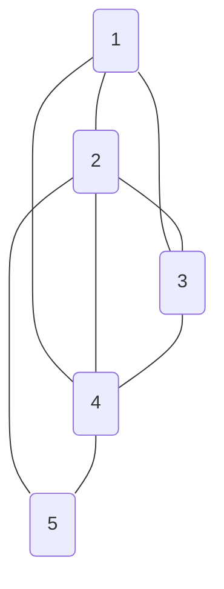

<1,2> <1,3> <1,4> <2,3> <2,4> <2,5> <3,4> <4,5> 
# Graph

### Adjacent List

<table style="border-collapse: collapse;">
	<tr>
<th style="width: 25px">[1]</th>		<th style="border: 2px solid #ffffff; width: 25px"></th>
		<th>→</th>
		<th style="border: 2px solid #ffffff; width: 25px">2</th>
		<th style="border: 2px solid #ffffff; width: 25px"></th>
		<th>→</th>
		<th style="border: 2px solid #ffffff; width: 25px">3</th>
		<th style="border: 2px solid #ffffff; width: 25px"></th>
		<th>→</th>
		<th style="border: 2px solid #ffffff; width: 25px">4</th>
		<th style="border: 2px solid #ffffff; width: 25px"></th>
</tr>
	<tr>
<th style="width: 25px">[2]</th>		<th style="border: 2px solid #ffffff; width: 25px"></th>
		<th>→</th>
		<th style="border: 2px solid #ffffff; width: 25px">1</th>
		<th style="border: 2px solid #ffffff; width: 25px"></th>
		<th>→</th>
		<th style="border: 2px solid #ffffff; width: 25px">3</th>
		<th style="border: 2px solid #ffffff; width: 25px"></th>
		<th>→</th>
		<th style="border: 2px solid #ffffff; width: 25px">4</th>
		<th style="border: 2px solid #ffffff; width: 25px"></th>
		<th>→</th>
		<th style="border: 2px solid #ffffff; width: 25px">5</th>
		<th style="border: 2px solid #ffffff; width: 25px"></th>
</tr>
	<tr>
<th style="width: 25px">[3]</th>		<th style="border: 2px solid #ffffff; width: 25px"></th>
		<th>→</th>
		<th style="border: 2px solid #ffffff; width: 25px">1</th>
		<th style="border: 2px solid #ffffff; width: 25px"></th>
		<th>→</th>
		<th style="border: 2px solid #ffffff; width: 25px">2</th>
		<th style="border: 2px solid #ffffff; width: 25px"></th>
		<th>→</th>
		<th style="border: 2px solid #ffffff; width: 25px">4</th>
		<th style="border: 2px solid #ffffff; width: 25px"></th>
</tr>
	<tr>
<th style="width: 25px">[4]</th>		<th style="border: 2px solid #ffffff; width: 25px"></th>
		<th>→</th>
		<th style="border: 2px solid #ffffff; width: 25px">1</th>
		<th style="border: 2px solid #ffffff; width: 25px"></th>
		<th>→</th>
		<th style="border: 2px solid #ffffff; width: 25px">2</th>
		<th style="border: 2px solid #ffffff; width: 25px"></th>
		<th>→</th>
		<th style="border: 2px solid #ffffff; width: 25px">3</th>
		<th style="border: 2px solid #ffffff; width: 25px"></th>
		<th>→</th>
		<th style="border: 2px solid #ffffff; width: 25px">5</th>
		<th style="border: 2px solid #ffffff; width: 25px"></th>
</tr>
	<tr>
<th style="width: 25px">[5]</th>		<th style="border: 2px solid #ffffff; width: 25px"></th>
		<th>→</th>
		<th style="border: 2px solid #ffffff; width: 25px">2</th>
		<th style="border: 2px solid #ffffff; width: 25px"></th>
		<th>→</th>
		<th style="border: 2px solid #ffffff; width: 25px">4</th>
		<th style="border: 2px solid #ffffff; width: 25px"></th>
</tr>
</table>
### Adjacent Matrix

$$\begin {array} {cc}
\begin {matrix}
& 1& 2& 3& 4& 5
\end {matrix} \\
\begin {matrix}
1 \\2 \\3 \\4 \\5 \\
\end {matrix}
\begin {bmatrix}
0 & 1 & 1 & 1 & 0 \\
1 & 0 & 1 & 1 & 1 \\
1 & 1 & 0 & 1 & 0 \\
1 & 1 & 1 & 0 & 1 \\
0 & 1 & 0 & 1 & 0 \\
\end {bmatrix}
\end{array}$$

