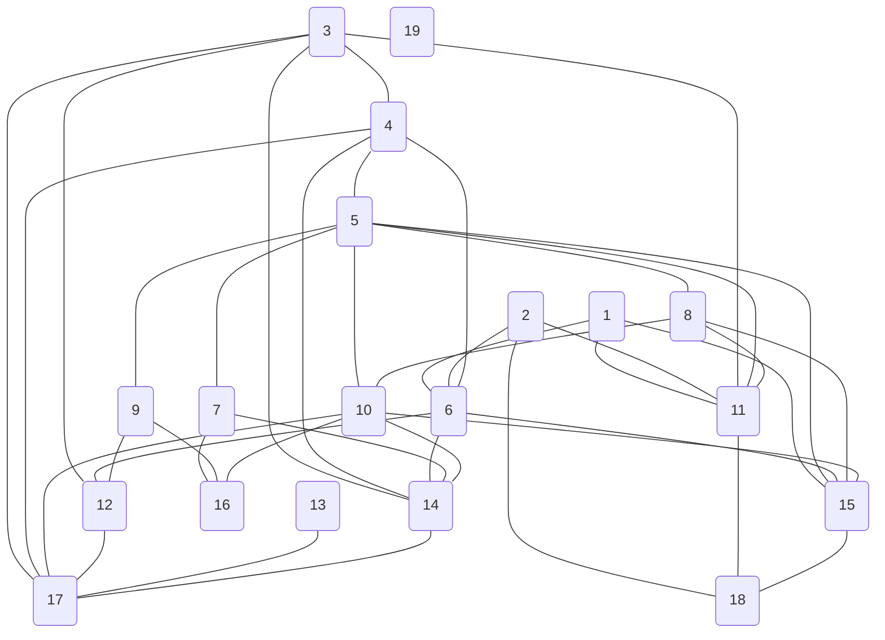

<1,6> <1,11> <1,15> <2,6> <2,11> <2,18> <3,4> <3,11> <3,12> <3,14> <3,17> <4,5> <4,6> <4,14> <4,17> <5,7> <5,8> <5,9> <5,10> <5,11> <5,15> <6,12> <6,14> <6,15> <7,14> <7,16> <8,10> <8,11> <8,15> <9,12> <9,16> <10,14> <10,15> <10,16> <10,17> <11,18> <12,17> <13,17> <14,17> <15,18> 
# Graph

### Adjacent List

<table style="border-collapse: collapse;">
	<tr>
<th style="width: 25px">[1]</th>		<th style="border: 2px solid #ffffff; width: 25px"></th>
		<th>→</th>
		<th style="border: 2px solid #ffffff; width: 25px">6</th>
		<th style="border: 2px solid #ffffff; width: 25px"></th>
		<th>→</th>
		<th style="border: 2px solid #ffffff; width: 25px">11</th>
		<th style="border: 2px solid #ffffff; width: 25px"></th>
		<th>→</th>
		<th style="border: 2px solid #ffffff; width: 25px">15</th>
		<th style="border: 2px solid #ffffff; width: 25px"></th>
</tr>
	<tr>
<th style="width: 25px">[2]</th>		<th style="border: 2px solid #ffffff; width: 25px"></th>
		<th>→</th>
		<th style="border: 2px solid #ffffff; width: 25px">6</th>
		<th style="border: 2px solid #ffffff; width: 25px"></th>
		<th>→</th>
		<th style="border: 2px solid #ffffff; width: 25px">11</th>
		<th style="border: 2px solid #ffffff; width: 25px"></th>
		<th>→</th>
		<th style="border: 2px solid #ffffff; width: 25px">18</th>
		<th style="border: 2px solid #ffffff; width: 25px"></th>
</tr>
	<tr>
<th style="width: 25px">[3]</th>		<th style="border: 2px solid #ffffff; width: 25px"></th>
		<th>→</th>
		<th style="border: 2px solid #ffffff; width: 25px">4</th>
		<th style="border: 2px solid #ffffff; width: 25px"></th>
		<th>→</th>
		<th style="border: 2px solid #ffffff; width: 25px">11</th>
		<th style="border: 2px solid #ffffff; width: 25px"></th>
		<th>→</th>
		<th style="border: 2px solid #ffffff; width: 25px">12</th>
		<th style="border: 2px solid #ffffff; width: 25px"></th>
		<th>→</th>
		<th style="border: 2px solid #ffffff; width: 25px">14</th>
		<th style="border: 2px solid #ffffff; width: 25px"></th>
		<th>→</th>
		<th style="border: 2px solid #ffffff; width: 25px">17</th>
		<th style="border: 2px solid #ffffff; width: 25px"></th>
</tr>
	<tr>
<th style="width: 25px">[4]</th>		<th style="border: 2px solid #ffffff; width: 25px"></th>
		<th>→</th>
		<th style="border: 2px solid #ffffff; width: 25px">3</th>
		<th style="border: 2px solid #ffffff; width: 25px"></th>
		<th>→</th>
		<th style="border: 2px solid #ffffff; width: 25px">5</th>
		<th style="border: 2px solid #ffffff; width: 25px"></th>
		<th>→</th>
		<th style="border: 2px solid #ffffff; width: 25px">6</th>
		<th style="border: 2px solid #ffffff; width: 25px"></th>
		<th>→</th>
		<th style="border: 2px solid #ffffff; width: 25px">14</th>
		<th style="border: 2px solid #ffffff; width: 25px"></th>
		<th>→</th>
		<th style="border: 2px solid #ffffff; width: 25px">17</th>
		<th style="border: 2px solid #ffffff; width: 25px"></th>
</tr>
	<tr>
<th style="width: 25px">[5]</th>		<th style="border: 2px solid #ffffff; width: 25px"></th>
		<th>→</th>
		<th style="border: 2px solid #ffffff; width: 25px">4</th>
		<th style="border: 2px solid #ffffff; width: 25px"></th>
		<th>→</th>
		<th style="border: 2px solid #ffffff; width: 25px">7</th>
		<th style="border: 2px solid #ffffff; width: 25px"></th>
		<th>→</th>
		<th style="border: 2px solid #ffffff; width: 25px">8</th>
		<th style="border: 2px solid #ffffff; width: 25px"></th>
		<th>→</th>
		<th style="border: 2px solid #ffffff; width: 25px">9</th>
		<th style="border: 2px solid #ffffff; width: 25px"></th>
		<th>→</th>
		<th style="border: 2px solid #ffffff; width: 25px">10</th>
		<th style="border: 2px solid #ffffff; width: 25px"></th>
		<th>→</th>
		<th style="border: 2px solid #ffffff; width: 25px">11</th>
		<th style="border: 2px solid #ffffff; width: 25px"></th>
		<th>→</th>
		<th style="border: 2px solid #ffffff; width: 25px">15</th>
		<th style="border: 2px solid #ffffff; width: 25px"></th>
</tr>
	<tr>
<th style="width: 25px">[6]</th>		<th style="border: 2px solid #ffffff; width: 25px"></th>
		<th>→</th>
		<th style="border: 2px solid #ffffff; width: 25px">1</th>
		<th style="border: 2px solid #ffffff; width: 25px"></th>
		<th>→</th>
		<th style="border: 2px solid #ffffff; width: 25px">2</th>
		<th style="border: 2px solid #ffffff; width: 25px"></th>
		<th>→</th>
		<th style="border: 2px solid #ffffff; width: 25px">4</th>
		<th style="border: 2px solid #ffffff; width: 25px"></th>
		<th>→</th>
		<th style="border: 2px solid #ffffff; width: 25px">12</th>
		<th style="border: 2px solid #ffffff; width: 25px"></th>
		<th>→</th>
		<th style="border: 2px solid #ffffff; width: 25px">14</th>
		<th style="border: 2px solid #ffffff; width: 25px"></th>
		<th>→</th>
		<th style="border: 2px solid #ffffff; width: 25px">15</th>
		<th style="border: 2px solid #ffffff; width: 25px"></th>
</tr>
	<tr>
<th style="width: 25px">[7]</th>		<th style="border: 2px solid #ffffff; width: 25px"></th>
		<th>→</th>
		<th style="border: 2px solid #ffffff; width: 25px">5</th>
		<th style="border: 2px solid #ffffff; width: 25px"></th>
		<th>→</th>
		<th style="border: 2px solid #ffffff; width: 25px">14</th>
		<th style="border: 2px solid #ffffff; width: 25px"></th>
		<th>→</th>
		<th style="border: 2px solid #ffffff; width: 25px">16</th>
		<th style="border: 2px solid #ffffff; width: 25px"></th>
</tr>
	<tr>
<th style="width: 25px">[8]</th>		<th style="border: 2px solid #ffffff; width: 25px"></th>
		<th>→</th>
		<th style="border: 2px solid #ffffff; width: 25px">5</th>
		<th style="border: 2px solid #ffffff; width: 25px"></th>
		<th>→</th>
		<th style="border: 2px solid #ffffff; width: 25px">10</th>
		<th style="border: 2px solid #ffffff; width: 25px"></th>
		<th>→</th>
		<th style="border: 2px solid #ffffff; width: 25px">11</th>
		<th style="border: 2px solid #ffffff; width: 25px"></th>
		<th>→</th>
		<th style="border: 2px solid #ffffff; width: 25px">15</th>
		<th style="border: 2px solid #ffffff; width: 25px"></th>
</tr>
	<tr>
<th style="width: 25px">[9]</th>		<th style="border: 2px solid #ffffff; width: 25px"></th>
		<th>→</th>
		<th style="border: 2px solid #ffffff; width: 25px">5</th>
		<th style="border: 2px solid #ffffff; width: 25px"></th>
		<th>→</th>
		<th style="border: 2px solid #ffffff; width: 25px">12</th>
		<th style="border: 2px solid #ffffff; width: 25px"></th>
		<th>→</th>
		<th style="border: 2px solid #ffffff; width: 25px">16</th>
		<th style="border: 2px solid #ffffff; width: 25px"></th>
</tr>
	<tr>
<th style="width: 25px">[10]</th>		<th style="border: 2px solid #ffffff; width: 25px"></th>
		<th>→</th>
		<th style="border: 2px solid #ffffff; width: 25px">5</th>
		<th style="border: 2px solid #ffffff; width: 25px"></th>
		<th>→</th>
		<th style="border: 2px solid #ffffff; width: 25px">8</th>
		<th style="border: 2px solid #ffffff; width: 25px"></th>
		<th>→</th>
		<th style="border: 2px solid #ffffff; width: 25px">14</th>
		<th style="border: 2px solid #ffffff; width: 25px"></th>
		<th>→</th>
		<th style="border: 2px solid #ffffff; width: 25px">15</th>
		<th style="border: 2px solid #ffffff; width: 25px"></th>
		<th>→</th>
		<th style="border: 2px solid #ffffff; width: 25px">16</th>
		<th style="border: 2px solid #ffffff; width: 25px"></th>
		<th>→</th>
		<th style="border: 2px solid #ffffff; width: 25px">17</th>
		<th style="border: 2px solid #ffffff; width: 25px"></th>
</tr>
	<tr>
<th style="width: 25px">[11]</th>		<th style="border: 2px solid #ffffff; width: 25px"></th>
		<th>→</th>
		<th style="border: 2px solid #ffffff; width: 25px">1</th>
		<th style="border: 2px solid #ffffff; width: 25px"></th>
		<th>→</th>
		<th style="border: 2px solid #ffffff; width: 25px">2</th>
		<th style="border: 2px solid #ffffff; width: 25px"></th>
		<th>→</th>
		<th style="border: 2px solid #ffffff; width: 25px">3</th>
		<th style="border: 2px solid #ffffff; width: 25px"></th>
		<th>→</th>
		<th style="border: 2px solid #ffffff; width: 25px">5</th>
		<th style="border: 2px solid #ffffff; width: 25px"></th>
		<th>→</th>
		<th style="border: 2px solid #ffffff; width: 25px">8</th>
		<th style="border: 2px solid #ffffff; width: 25px"></th>
		<th>→</th>
		<th style="border: 2px solid #ffffff; width: 25px">18</th>
		<th style="border: 2px solid #ffffff; width: 25px"></th>
</tr>
	<tr>
<th style="width: 25px">[12]</th>		<th style="border: 2px solid #ffffff; width: 25px"></th>
		<th>→</th>
		<th style="border: 2px solid #ffffff; width: 25px">3</th>
		<th style="border: 2px solid #ffffff; width: 25px"></th>
		<th>→</th>
		<th style="border: 2px solid #ffffff; width: 25px">6</th>
		<th style="border: 2px solid #ffffff; width: 25px"></th>
		<th>→</th>
		<th style="border: 2px solid #ffffff; width: 25px">9</th>
		<th style="border: 2px solid #ffffff; width: 25px"></th>
		<th>→</th>
		<th style="border: 2px solid #ffffff; width: 25px">17</th>
		<th style="border: 2px solid #ffffff; width: 25px"></th>
</tr>
	<tr>
<th style="width: 25px">[13]</th>		<th style="border: 2px solid #ffffff; width: 25px"></th>
		<th>→</th>
		<th style="border: 2px solid #ffffff; width: 25px">17</th>
		<th style="border: 2px solid #ffffff; width: 25px"></th>
</tr>
	<tr>
<th style="width: 25px">[14]</th>		<th style="border: 2px solid #ffffff; width: 25px"></th>
		<th>→</th>
		<th style="border: 2px solid #ffffff; width: 25px">3</th>
		<th style="border: 2px solid #ffffff; width: 25px"></th>
		<th>→</th>
		<th style="border: 2px solid #ffffff; width: 25px">4</th>
		<th style="border: 2px solid #ffffff; width: 25px"></th>
		<th>→</th>
		<th style="border: 2px solid #ffffff; width: 25px">6</th>
		<th style="border: 2px solid #ffffff; width: 25px"></th>
		<th>→</th>
		<th style="border: 2px solid #ffffff; width: 25px">7</th>
		<th style="border: 2px solid #ffffff; width: 25px"></th>
		<th>→</th>
		<th style="border: 2px solid #ffffff; width: 25px">10</th>
		<th style="border: 2px solid #ffffff; width: 25px"></th>
		<th>→</th>
		<th style="border: 2px solid #ffffff; width: 25px">17</th>
		<th style="border: 2px solid #ffffff; width: 25px"></th>
</tr>
	<tr>
<th style="width: 25px">[15]</th>		<th style="border: 2px solid #ffffff; width: 25px"></th>
		<th>→</th>
		<th style="border: 2px solid #ffffff; width: 25px">1</th>
		<th style="border: 2px solid #ffffff; width: 25px"></th>
		<th>→</th>
		<th style="border: 2px solid #ffffff; width: 25px">5</th>
		<th style="border: 2px solid #ffffff; width: 25px"></th>
		<th>→</th>
		<th style="border: 2px solid #ffffff; width: 25px">6</th>
		<th style="border: 2px solid #ffffff; width: 25px"></th>
		<th>→</th>
		<th style="border: 2px solid #ffffff; width: 25px">8</th>
		<th style="border: 2px solid #ffffff; width: 25px"></th>
		<th>→</th>
		<th style="border: 2px solid #ffffff; width: 25px">10</th>
		<th style="border: 2px solid #ffffff; width: 25px"></th>
		<th>→</th>
		<th style="border: 2px solid #ffffff; width: 25px">18</th>
		<th style="border: 2px solid #ffffff; width: 25px"></th>
</tr>
	<tr>
<th style="width: 25px">[16]</th>		<th style="border: 2px solid #ffffff; width: 25px"></th>
		<th>→</th>
		<th style="border: 2px solid #ffffff; width: 25px">7</th>
		<th style="border: 2px solid #ffffff; width: 25px"></th>
		<th>→</th>
		<th style="border: 2px solid #ffffff; width: 25px">9</th>
		<th style="border: 2px solid #ffffff; width: 25px"></th>
		<th>→</th>
		<th style="border: 2px solid #ffffff; width: 25px">10</th>
		<th style="border: 2px solid #ffffff; width: 25px"></th>
</tr>
	<tr>
<th style="width: 25px">[17]</th>		<th style="border: 2px solid #ffffff; width: 25px"></th>
		<th>→</th>
		<th style="border: 2px solid #ffffff; width: 25px">3</th>
		<th style="border: 2px solid #ffffff; width: 25px"></th>
		<th>→</th>
		<th style="border: 2px solid #ffffff; width: 25px">4</th>
		<th style="border: 2px solid #ffffff; width: 25px"></th>
		<th>→</th>
		<th style="border: 2px solid #ffffff; width: 25px">10</th>
		<th style="border: 2px solid #ffffff; width: 25px"></th>
		<th>→</th>
		<th style="border: 2px solid #ffffff; width: 25px">12</th>
		<th style="border: 2px solid #ffffff; width: 25px"></th>
		<th>→</th>
		<th style="border: 2px solid #ffffff; width: 25px">13</th>
		<th style="border: 2px solid #ffffff; width: 25px"></th>
		<th>→</th>
		<th style="border: 2px solid #ffffff; width: 25px">14</th>
		<th style="border: 2px solid #ffffff; width: 25px"></th>
</tr>
	<tr>
<th style="width: 25px">[18]</th>		<th style="border: 2px solid #ffffff; width: 25px"></th>
		<th>→</th>
		<th style="border: 2px solid #ffffff; width: 25px">2</th>
		<th style="border: 2px solid #ffffff; width: 25px"></th>
		<th>→</th>
		<th style="border: 2px solid #ffffff; width: 25px">11</th>
		<th style="border: 2px solid #ffffff; width: 25px"></th>
		<th>→</th>
		<th style="border: 2px solid #ffffff; width: 25px">15</th>
		<th style="border: 2px solid #ffffff; width: 25px"></th>
</tr>
	<tr>
<th style="width: 25px">[19]</th>		<th style="border: 2px solid #ffffff; width: 25px"></th>
</tr>
</table>
### Adjacent Matrix

$$\begin {array} {cc}
\begin {matrix}
& 1& 2& 3& 4& 5& 6& 7& 8& 9& 10& 11& 12& 13& 14& 15& 16& 17& 18& 19
\end {matrix} \\
\begin {matrix}
1 \\2 \\3 \\4 \\5 \\6 \\7 \\8 \\9 \\10 \\11 \\12 \\13 \\14 \\15 \\16 \\17 \\18 \\19 \\
\end {matrix}
\begin {bmatrix}
0 & 0 & 0 & 0 & 0 & 1 & 0 & 0 & 0 & 0 & 1 & 0 & 0 & 0 & 1 & 0 & 0 & 0 & 0 \\
0 & 0 & 0 & 0 & 0 & 1 & 0 & 0 & 0 & 0 & 1 & 0 & 0 & 0 & 0 & 0 & 0 & 1 & 0 \\
0 & 0 & 0 & 1 & 0 & 0 & 0 & 0 & 0 & 0 & 1 & 1 & 0 & 1 & 0 & 0 & 1 & 0 & 0 \\
0 & 0 & 1 & 0 & 1 & 1 & 0 & 0 & 0 & 0 & 0 & 0 & 0 & 1 & 0 & 0 & 1 & 0 & 0 \\
0 & 0 & 0 & 1 & 0 & 0 & 1 & 1 & 1 & 1 & 1 & 0 & 0 & 0 & 1 & 0 & 0 & 0 & 0 \\
1 & 1 & 0 & 1 & 0 & 0 & 0 & 0 & 0 & 0 & 0 & 1 & 0 & 1 & 1 & 0 & 0 & 0 & 0 \\
0 & 0 & 0 & 0 & 1 & 0 & 0 & 0 & 0 & 0 & 0 & 0 & 0 & 1 & 0 & 1 & 0 & 0 & 0 \\
0 & 0 & 0 & 0 & 1 & 0 & 0 & 0 & 0 & 1 & 1 & 0 & 0 & 0 & 1 & 0 & 0 & 0 & 0 \\
0 & 0 & 0 & 0 & 1 & 0 & 0 & 0 & 0 & 0 & 0 & 1 & 0 & 0 & 0 & 1 & 0 & 0 & 0 \\
0 & 0 & 0 & 0 & 1 & 0 & 0 & 1 & 0 & 0 & 0 & 0 & 0 & 1 & 1 & 1 & 1 & 0 & 0 \\
1 & 1 & 1 & 0 & 1 & 0 & 0 & 1 & 0 & 0 & 0 & 0 & 0 & 0 & 0 & 0 & 0 & 1 & 0 \\
0 & 0 & 1 & 0 & 0 & 1 & 0 & 0 & 1 & 0 & 0 & 0 & 0 & 0 & 0 & 0 & 1 & 0 & 0 \\
0 & 0 & 0 & 0 & 0 & 0 & 0 & 0 & 0 & 0 & 0 & 0 & 0 & 0 & 0 & 0 & 1 & 0 & 0 \\
0 & 0 & 1 & 1 & 0 & 1 & 1 & 0 & 0 & 1 & 0 & 0 & 0 & 0 & 0 & 0 & 1 & 0 & 0 \\
1 & 0 & 0 & 0 & 1 & 1 & 0 & 1 & 0 & 1 & 0 & 0 & 0 & 0 & 0 & 0 & 0 & 1 & 0 \\
0 & 0 & 0 & 0 & 0 & 0 & 1 & 0 & 1 & 1 & 0 & 0 & 0 & 0 & 0 & 0 & 0 & 0 & 0 \\
0 & 0 & 1 & 1 & 0 & 0 & 0 & 0 & 0 & 1 & 0 & 1 & 1 & 1 & 0 & 0 & 0 & 0 & 0 \\
0 & 1 & 0 & 0 & 0 & 0 & 0 & 0 & 0 & 0 & 1 & 0 & 0 & 0 & 1 & 0 & 0 & 0 & 0 \\
0 & 0 & 0 & 0 & 0 & 0 & 0 & 0 & 0 & 0 & 0 & 0 & 0 & 0 & 0 & 0 & 0 & 0 & 0 \\
\end {bmatrix}
\end{array}$$

