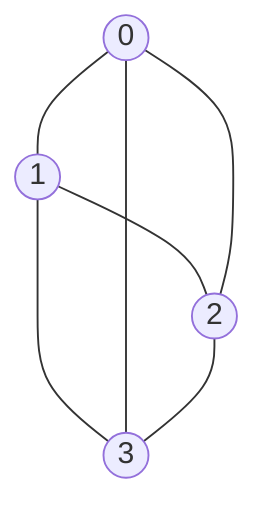

For $G=(V, E)$ with $n$ vertax, $n\geq 1$, use $n\times n$ matrix
* a\[i\]\[j\]=1, iff $\exists\ (i,j)\ or <i,j>$
* else a\[i\]\[j\]=0
Ex. 

$$
\begin {array} {cc}
\begin {matrix}
& 0 & 1 & 2 & 3 
\end {matrix} \\

\begin {matrix}
0 \\ 1 \\ 2 \\ 3 
\end {matrix}
\begin {bmatrix}
0 & 1 & 1 & 1 \\
1 & 0 & 1 & 1 \\
1 & 1 & 0 & 1 \\
1 & 1 & 1 & 0 \\
\end {bmatrix}
\end{array}
$$
### Attribute
* Space : n2 (n vertices) $\rightarrow O(n^2)$ or $n^2 - n$ (扣對角線)
* Symmetric matrix $\rightarrow$ half spaces
  * Unordered Graph, $\because (u,v)=(v,u)$ 
  * Diagraph can't
  * Ex. 
$$
\begin {array} {cc}
\begin {matrix}
& 0 & 1 & 2 & 3 
\end {matrix} \\
\begin {matrix}
0 \\ 1 \\ 2 \\ 3 
\end {matrix}
\begin {bmatrix}
0 &  &  &  \\
1 & 0 &  &  \\
1 & 1 & 0 &  \\
1 & 1 & 1 & 0 \\
\end {bmatrix}
\end{array}$$
* Degree in Unordered Graph 
  * row sum ( | 直的)
* Degree in Diagraph
  * in-degree : row sum ( | 直的)
  * out-degree : column sum ( - 橫的)
## Possible Question
How many edge are there in G?
![[Ajacent Matrix Q.png]]
Graph : (Sum of 1's) $\div$ 2
Diagraph : Sum of 1's ^480173

### Preference
when **dense** |E| $\approx$ |V|2
### Better Big-O
* most 稀疏矩陣
* want 以O(e+n), e(number of edge)<<n2/2
[[Adjacency Lists]]