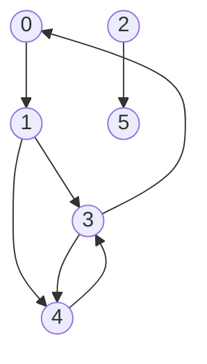

Uses chain to represent, one chain for every vertax

<table style="border-collapse: collapse;">
    <tr>
        <th style="width: 25px">[0]</th>
        <th style="border: 2px solid #ffffff; width: 25px"></th>
        <th>→</th>
        <th style="border: 2px solid #ffffff; width: 25px">1</th>
        <th style="border: 2px solid #ffffff; width: 25px"></th>
    </tr>
    <tr>
        <th style=" width: 25px">[1]</th>
        <th style="border: 2px solid #ffffff; width: 25px"></th>
        <th>→</th>
        <th style="border: 2px solid #ffffff; width: 25px">3</th>
        <th style="border: 2px solid #ffffff; width: 25px"></th>
        <th>→</th>
        <th style="border: 2px solid #ffffff; width: 25px">4</th>
        <th style="border: 2px solid #ffffff; width: 25px"></th>
    </tr>
    <tr>
        <th style="width: 25px">[2]</th>
        <th style="border: 2px solid #ffffff; width: 25px"></th>
    </tr>
    <tr>
        <th style="width: 25px">[3]</th>
        <th style="border: 2px solid #ffffff; width: 25px"></th>
        <th>→</th>
        <th style="border: 2px solid #ffffff; width: 25px">0</th>
        <th style="border: 2px solid #ffffff; width: 25px"></th>
        <th>→</th>
        <th style="border: 2px solid #ffffff; width: 25px">4</th>
        <th style="border: 2px solid #ffffff; width: 25px"></th>
    </tr>
    <tr>
        <th style="width: 25px">[4]</th>
        <th style="border: 2px solid #ffffff; width: 25px"></th>
        <th>→</th>
        <th style="border: 2px solid #ffffff; width: 25px">3</th>
        <th style="border: 2px solid #ffffff; width: 25px"></th>
    </tr>
    <tr>
        <th style="width: 25px">[5]</th>
        <th style="border: 2px solid #ffffff; width: 25px"></th>
        <th>→</th>
        <th style="border: 2px solid #ffffff; width: 25px">2</th>
        <th style="border: 2px solid #ffffff; width: 25px"></th>
    </tr>
</table>

### Attribute
* vertex degree : counting the number of arrows
* edges : same as [[Adjacency Matrix#^480173 | Adjacency Matrix]], change 1 to arrows

### Preference
when **sparse graphs** : |E| << |V|2
