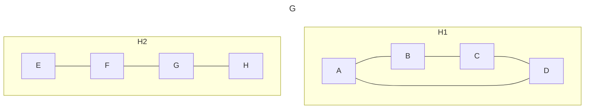

A graph with n node, e edges, store in node\[ \]
* 0~n-1 store  the starting index of each node
* n stores the size of array, to sep head nodes & edges
* n+1 ~ end store each edge
total size is $n + 2e + 1$

| 0| 1| 2| 3| 4| 5| 6| 7| *8*| 9|10|11|12|13|14|15|16|17|18|19|20|21|22|
|--|--|--|--|--|--|--|--|--|--|--|--|--|--|--|--|--|--|--|--|--|--|--|
| 9|11|13|15|17|18|20|22|*23*| 2| 1| 3| 0| 0| 3| 1| 2| 5| 6| 4| 5| 7| 6|
