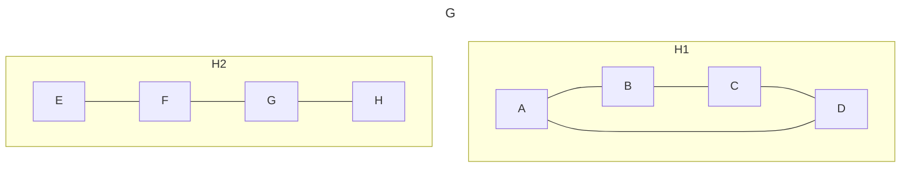

Connected component/component is the maximal connected [[subgraph]] in G
> Ex. G have 2 components, H1 & H2

```mermaid
---
title : G
---
graph TD
subgraph H1
	A --- B --- C --- D --- A
end
subgraph H2
	E --- F --- G --- H
end
```
