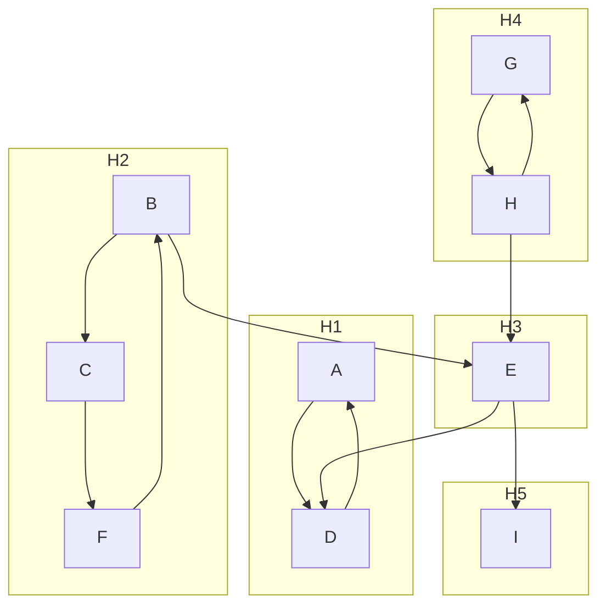
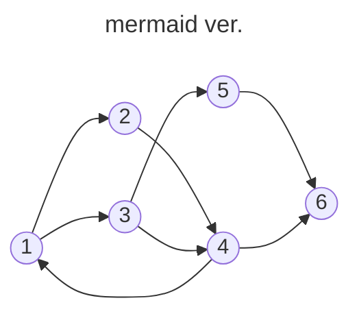

## Diagraph
### Strongly Connected
Diagraph G is Strongly Connected, iff 
* $\forall u, v \in V(G), \exists$ path from $u \rightarrow v$ and also $v \rightarrow u$
### Strongly [[Connected Component]]
maximal [[subgraph]] that is strongly connected

> Ex 在這個digraph有多少個Strongly [[Connected Component]]?![[Strong Connected diagraph.png]]
![[graphviz.svg]]

Ans : $3, H = \{1,2,3,4\},\{5\},\{6\}$