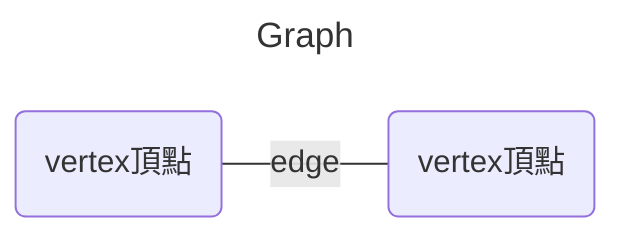
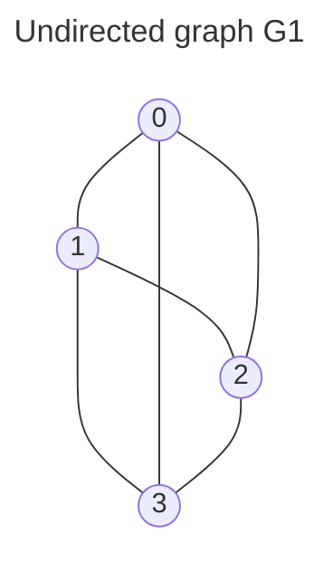
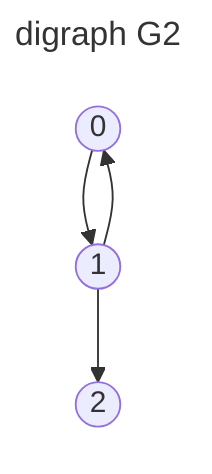

A graph, $G$, consists of two set, $V$ and $E$.
* $V$ : vertices/vertex(頂點)的集合, is a finite, nonempty set.
* $E$ : edges(邊)的集合, a set of pairs of vertices.

$G=(V,E)$ represent a graph

## Types
* Undirected graph 無向圖
  The pairs of vertices $(u, v)$ representing any edge is unordered.

* * $V(G1) = \{0,1,2,3\}$
  * $E(G1) = \{(0,1),(0,2),(0,3),(1,2),(1,3),(2,3)\}$

* Directed graph(digraph) 有向圖
  Each edge is representing by a directed pair $<u, v>$
  * $u$ : tail  
  * $v$ : head

* * $V(G2) = \{0,1,2\}$
  * $E(G2) = \{<0,1>,<1,0>,<1,2>\}$