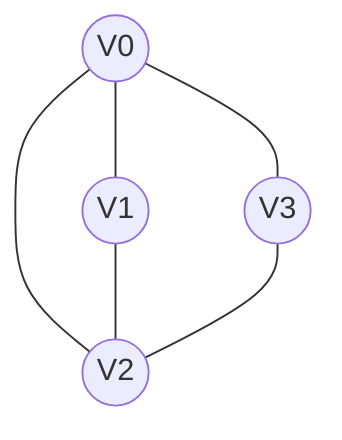
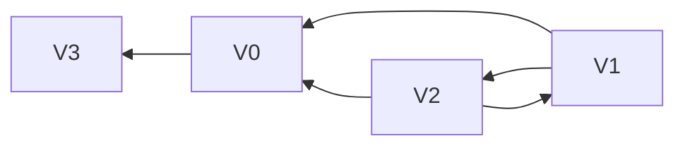

> Find V(G) & E(G)
  Adjacency matrix & Adjacency list

$V(G) = \{V_0, V_1, V_2, V_3\}$
$E(G) = \{(V_0, V_1), (V_0, V_2), (V_0, V_3), (V_1, V_2), (V_2,V_3) \}$
Adjacency matrix
$$\begin {array} {cc}
\begin {matrix}
& 0 & 1 & 2 & 3 
\end {matrix} \\
\begin {matrix}
0 \\ 1 \\ 2 \\ 3 
\end {matrix}
\begin {bmatrix}
0 & 1 & 1 & 1 \\
1 & 0 & 1 & 0 \\
1 & 1 & 0 & 1 \\
1 & 0 & 1 & 0 \\
\end {bmatrix}
\end{array}$$
Adjacency list
<table style="border-collapse: collapse;">
    <tr>
        <th style="width: 25px">[0]</th>
        <th style="border: 2px solid #ffffff; width: 25px"></th>
        <th>→</th>
        <th style="border: 2px solid #ffffff; width: 25px">1</th>
        <th style="border: 2px solid #ffffff; width: 25px"></th>
        <th>→</th>
        <th style="border: 2px solid #ffffff; width: 25px">2</th>
        <th style="border: 2px solid #ffffff; width: 25px"></th>
        <th>→</th>
        <th style="border: 2px solid #ffffff; width: 25px">3</th>
        <th style="border: 2px solid #ffffff; width: 25px"></th>
    </tr>
    <tr>
        <th style=" width: 25px">[1]</th>
        <th style="border: 2px solid #ffffff; width: 25px"></th>
        <th>→</th>
        <th style="border: 2px solid #ffffff; width: 25px">2</th>
        <th style="border: 2px solid #ffffff; width: 25px"></th>
        <th>→</th>
        <th style="border: 2px solid #ffffff; width: 25px">0</th>
        <th style="border: 2px solid #ffffff; width: 25px"></th>
    </tr>
    <tr>
        <th style="width: 25px">[2]</th>
        <th style="border: 2px solid #ffffff; width: 25px"></th>
        <th>→</th>
        <th style="border: 2px solid #ffffff; width: 25px">3</th>
        <th style="border: 2px solid #ffffff; width: 25px"></th>
        <th>→</th>
        <th style="border: 2px solid #ffffff; width: 25px">0</th>
        <th style="border: 2px solid #ffffff; width: 25px"></th>
        <th>→</th>
        <th style="border: 2px solid #ffffff; width: 25px">1</th>
        <th style="border: 2px solid #ffffff; width: 25px"></th>
    </tr>
    <tr>
        <th style="width: 25px">[3]</th>
        <th style="border: 2px solid #ffffff; width: 25px"></th>
        <th>→</th>
        <th style="border: 2px solid #ffffff; width: 25px">0</th>
        <th style="border: 2px solid #ffffff; width: 25px"></th>
        <th>→</th>
        <th style="border: 2px solid #ffffff; width: 25px">2</th>
        <th style="border: 2px solid #ffffff; width: 25px"></th>
    </tr>
</table>

> V(G) & E(G)
Adjacency matrix & Adjacency
list/inverse adjacency list

$V(G) = \{V_0, V_1, V_2, V_3\}$
$E(G) = \{<V_0, V_3>, <V_1, V_0>, <V_1, V_2>, <V_2, V_1>, <V_2,V_0> \}$Adjacency matrix
$$\begin {array} {cc}
\begin {matrix}
& 0 & 1 & 2 & 3 
\end {matrix} \\
\begin {matrix}
0 \\ 1 \\ 2 \\ 3 
\end {matrix}
\begin {bmatrix}
0 & 0 & 0 & 1 \\
1 & 0 & 1 & 0 \\
1 & 1 & 0 & 0 \\
0 & 0 & 0 & 0 \\
\end {bmatrix}
\end{array}$$
Adjacency list
<table style="border-collapse: collapse;">
    <tr>
        <th style="width: 25px">[0]</th>
        <th style="border: 2px solid #ffffff; width: 25px"></th>
        <th>→</th>
        <th style="border: 2px solid #ffffff; width: 25px">3</th>
        <th style="border: 2px solid #ffffff; width: 25px"></th>
    </tr>
    <tr>
        <th style=" width: 25px">[1]</th>
        <th style="border: 2px solid #ffffff; width: 25px"></th>
        <th>→</th>
        <th style="border: 2px solid #ffffff; width: 25px">2</th>
        <th style="border: 2px solid #ffffff; width: 25px"></th>
        <th>→</th>
        <th style="border: 2px solid #ffffff; width: 25px">0</th>
        <th style="border: 2px solid #ffffff; width: 25px"></th>
    </tr>
    <tr>
        <th style="width: 25px">[2]</th>
        <th style="border: 2px solid #ffffff; width: 25px"></th>
        <th>→</th>
        <th style="border: 2px solid #ffffff; width: 25px">0</th>
        <th style="border: 2px solid #ffffff; width: 25px"></th>
        <th>→</th>
        <th style="border: 2px solid #ffffff; width: 25px">1</th>
        <th style="border: 2px solid #ffffff; width: 25px"></th>
    </tr>
    <tr>
        <th style="width: 25px">[3]</th>
        <th style="border: 2px solid #ffffff; width: 25px"></th>
    </tr>
</table>

Inverse Adjacency list
<table style="border-collapse: collapse;">
    <tr>
        <th style="width: 25px">[0]</th>
        <th style="border: 2px solid #ffffff; width: 25px"></th>
        <th>→</th>
        <th style="border: 2px solid #ffffff; width: 25px">1</th>
        <th style="border: 2px solid #ffffff; width: 25px"></th>
        <th>→</th>
        <th style="border: 2px solid #ffffff; width: 25px">2</th>
        <th style="border: 2px solid #ffffff; width: 25px"></th>
    </tr>
    <tr>
        <th style=" width: 25px">[1]</th>
        <th style="border: 2px solid #ffffff; width: 25px"></th>
        <th>→</th>
        <th style="border: 2px solid #ffffff; width: 25px">2</th>
        <th style="border: 2px solid #ffffff; width: 25px"></th>
    </tr>
    <tr>
        <th style="width: 25px">[2]</th>
        <th style="border: 2px solid #ffffff; width: 25px"></th>
        <th>→</th>
        <th style="border: 2px solid #ffffff; width: 25px">1</th>
        <th style="border: 2px solid #ffffff; width: 25px"></th>
    </tr>
    <tr>
        <th style="width: 25px">[3]</th>
        <th style="border: 2px solid #ffffff; width: 25px"></th>
        <th>→</th>
        <th style="border: 2px solid #ffffff; width: 25px">0</th>
        <th style="border: 2px solid #ffffff; width: 25px"></th>
    </tr>
</table>
