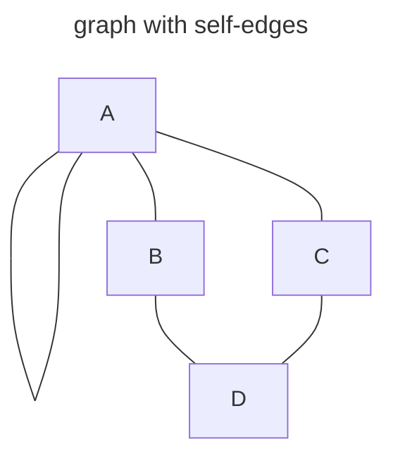
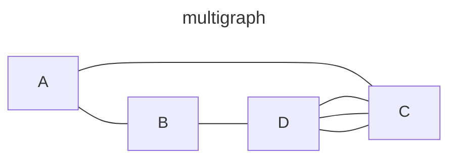

### graph with self edges
* A graph may not have an edge from a vertex, v, back to itself.
  * i.e. $(v, v)$ or $<v, v>$ are not legal
  * Such edges is called **self edges** or **self loops**.

### multigraph
* A graph may not have multiple occurrences of the same edge.
  * A graph with it is called multigraph
