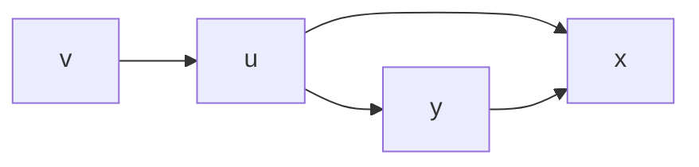

relax for shortest path
### spirit concept
if vertax $Y$ can reach vertax $X$, and go through $Y$ can shrink the dist. from start to $X$, then add Y to this path and update the shortest dist.
Ex.

Original SP : $V_0 \rightarrow u \rightarrow x$
if $u \rightarrow y + y \rightarrow x < u \rightarrow x$
New SP : $V_0 \rightarrow u \rightarrow y \rightarrow x$

### pseudo-code
```python
def relax(u, v, w) :
	if v.d > u.d + w(u, v):
		v.d = u.d + w(u, v)
		v.pi = u
```