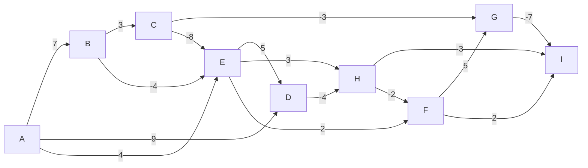

Bellman-Ford Practice    
> Using Bellman-Ford algorithm to find the SSSP, S0 is 0
> ![[Bellman-Ford Practice.png]]

Each pass relaxes the edge
in the order
<A, B> <A, D> <A,E>
<B, C> <B, E>
<C, E> <C, G>
<D, H>
<E, D> <E, F> <E, H>
<F, G> <F, I>
<G, I>
<H, F> <H, I>

SSSP Result : 

|  k |  A  |  B  |  C  |  D  |  E  |  F  |  G  |  H  |  I  |
|:--:|:--:|:--:|:--:|:--:|:--:|:--:|:--:|:--:|:--:|
| 1 | 0 | 7 | 10 | 9 $\rightarrow$ 7 | 4 $\rightarrow$ 3 $\rightarrow$ 2 | 4 $\rightarrow$ 3 | 7 | 5 | 6 $\rightarrow$ 0 |
| 2 | 0 | 7 | 10 | 7 | 2 | 3 $\rightarrow$ 1 | 7 | 3 | 0 |
| 3 | 0 | 7 | 10 | 7 | 2 | 1 | 7 $\rightarrow$ 6 | 3 | 0 $\rightarrow$ -1 |
| 4 | 0 | 7 | 10 | 7 | 2 | 1 | 6 | 3 | -1 |

