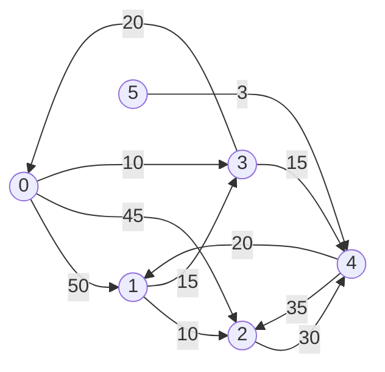

Single-Source Shortest Paths
### Defination
To find a shortest path from a given source vertex
can solve :
* Single-destination shortest-paths problem
  Find a shortest path to given destination vertex rom each vertex v
* Single-pair shortest-paths problem
  Find a shortest path from u to v for given vertices u and v
* All-pairs shortest-paths problem **APSP**
  Find a shortest path from u to v for each pair of vertices u and v

### Algorithm
1. [[Dijkstra’s algorithm]] (weight > 0)
2. [[Bellman-Ford algorithm]]

##### Example

|TO VERTEX|PATH|LENGTH|
|:---:|:--|:---:|
|3|0$\rightarrow$ 3|10|
|4| 0$\rightarrow$ 3$\rightarrow$ 4 |25|
|1| 0$\rightarrow$ 3$\rightarrow$ 4$\rightarrow$ 1 |45|
|2 |0$\rightarrow$ 2 |45|
|5| No path|
