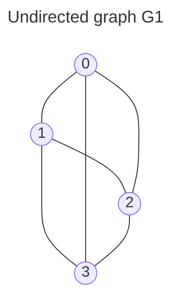
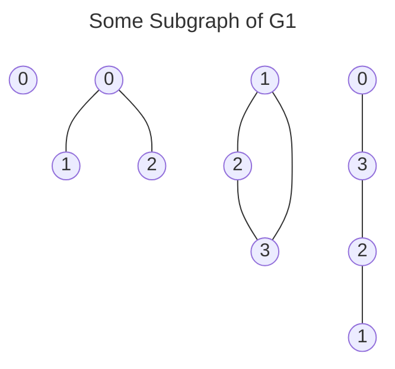
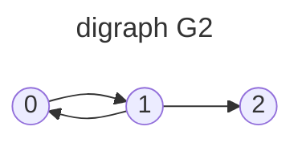
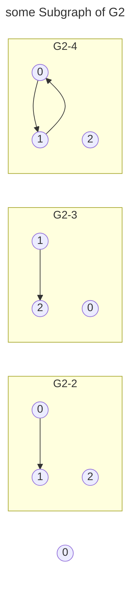

### Subgraph
A subgraph (子圖) of $G$ is a graph $G’$ such that $V(G’)⊆V(G)$ and $E(G’) ⊆ E(G)$

```mermaid
---
title: Undirected graph G1
---
graph TD
	A((0)) --- B((1)) --- D((3))
	B --- C((2))
	A --- D
	A --- C --- D
```

```mermaid 
---
title: Some Subgraph of G1
---
graph TD
	E((0))
	F((0)) --- G((1)) & H((2))
	I((1)) --- J((2)) --- K((3)) --- I
	A((0)) --- D((3)) --- C((2)) --- B((1))
```

```mermaid
---
title: digraph G2
---
graph LR
	A((0)) --> B((1)) --> A
	B --> C((2))
```

```mermaid
---
title: some Subgraph of G2
---
graph LR
	D((0))
	subgraph G2-2 
		E((0)) --> F((1)) 
		G((2))
	end
	subgraph G2-3
		I((1)) --> J((2)) 
		H((0))
	end
	subgraph G2-4
		A((0)) --> B((1)) --> A
		C((2))
	end
```
