#### Introuction & advantages
* Merge sort needs **additional storage space** proportional to the number of records in the file being sorted, even though its computing time is $O(n \log n)$
* Heap sort only requires a **fixed amount of additional storage** and achieves the **worst-case and average computing time** $O(n \log n)$

### Method
Heap sort uses the **max-heap** structure.
1. The n records are inserted into an empty heap.
2. The records are extracted from the heap one at a time (**extracted from root**). With the use of a special function [[#Adjust Function]], we can create a heap of n records **faster**.
* If the depth of [[heap]] tree is d, the computing time of [[#Adjust Function]] is $O(d)$

#### Example
Initialize the heap
![[Heap Sort init.png]]
Sorting use Adjust function
![[Heap Sort adjust.png]]

### Adjust Function
```cpp
// 調整一棵樹根為root的二元樹使其符合堆積的性質。此時root的左、右子樹都已經符合堆積的性質。沒有一個節點的索引值 > n
template <class T>
void Adjust(T*a, const int root, const int n){ 
	// 找到e的適當位置
	T e = a[root];
	for (int j = 2*root; j <= n; j *= 2) {
		// let j become 它父親的最大兒子
		if (j < n && a[j] < a[j+1]) j++;
		// e可以插入成為j的父親
		if (e >= a[j]) break;
		// 把第j筆記錄往樹的上方移動
		a[j/2] = a[j];
	}
	a[j/2] = e;
}
```

### Heap Sort
```cpp
template <class T>
// 將a[1:n] 排序成非遞減的順序
void HeapSort(T*a, const int n) {
	// 建立堆積
	for (int i= n/2; i >= 1; i--) 
		Adjust(a, i, n);
	// 排序
	for (int i = n-1; i >= 1; i--) {
		// 對調目前堆疊中的第一個與最後一個
		swap(a[1], a[i+1]); 
		// 建立堆疊
		Adjust(a, 1, i); 
	}
}
```

##### Example
>Write the status of list {12, 2, 16, 30, 8, 28, 4, 10, 20, 6, 18} at the end of the first for loop as well as the end of each iteration of the second for loop of HeapSort

Initial 
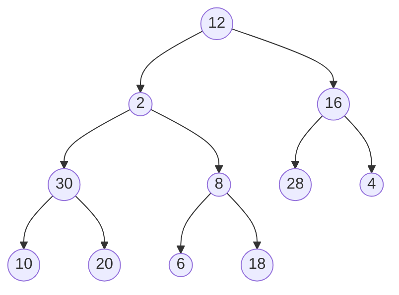
|12|2|16|30|8|28|4|10|20|6|18|
|--|--|--|--|--|--|--|--|--|--|--|
After 1<sup>st</sup> for loop
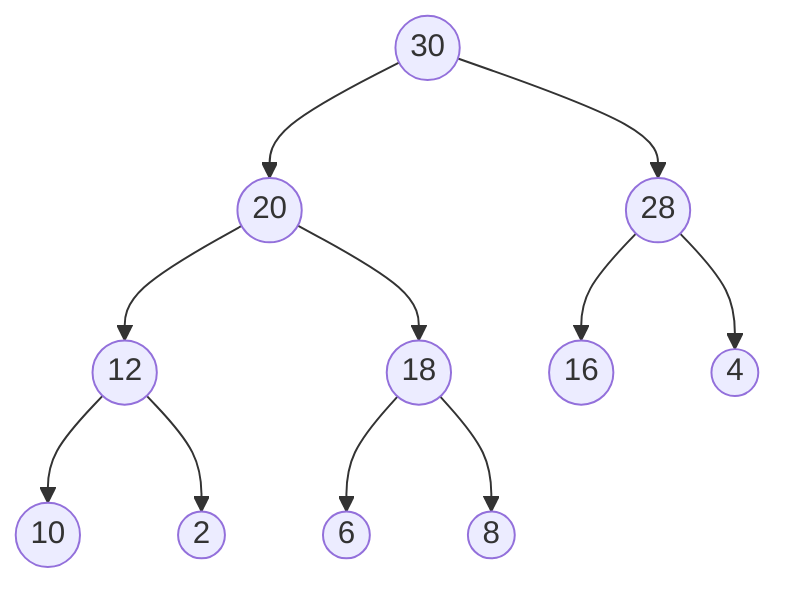
|value|30|20|28|12|18|16|4|10|2|6|8|
|--|--|--|--|--|--|--|--|--|--|--|--|
|\[ i \]|\[1\]|\[2\]|\[3\]|\[4\]|\[5\]|\[6\]|\[7\]|\[8\]|\[9\]|\[10\]|\[11\]|
2<sup>nd</sup> for loop, i = 10
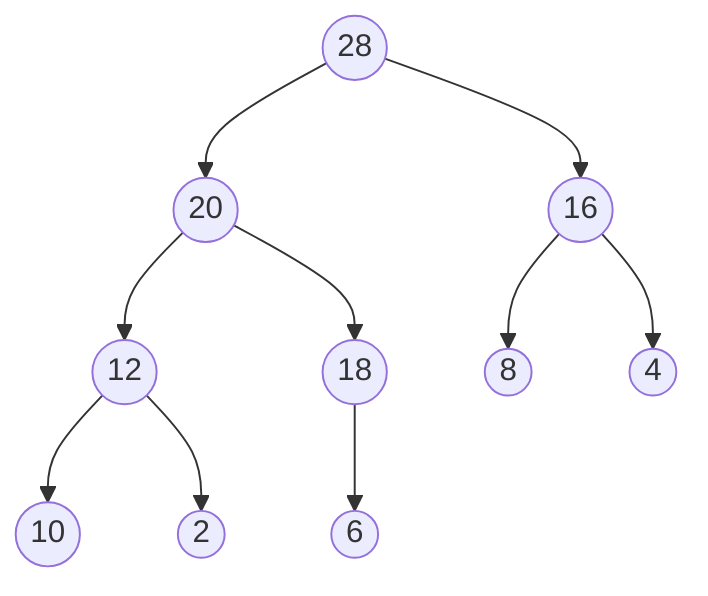
|value|28|20|16|12|18|8|4|10|2|6|30|
|--|--|--|--|--|--|--|--|--|--|--|--|
|\[ i \]|\[1\]|\[2\]|\[3\]|\[4\]|\[5\]|\[6\]|\[7\]|\[8\]|\[9\]|\[10\]|\[11\]|
2<sup>nd</sup> for loop, i = 9
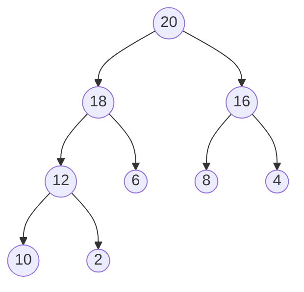
|value|20|18|16|12|6|8|4|10|2|28|30|
|--|--|--|--|--|--|--|--|--|--|--|--|
|\[ i \]|\[1\]|\[2\]|\[3\]|\[4\]|\[5\]|\[6\]|\[7\]|\[8\]|\[9\]|\[10\]|\[11\]|
2<sup>nd</sup> for loop, i = 8
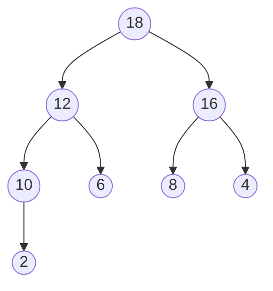
|value|18|12|16|10|6|8|4|2|20|28|30|
|--|--|--|--|--|--|--|--|--|--|--|--|
|\[ i \]|\[1\]|\[2\]|\[3\]|\[4\]|\[5\]|\[6\]|\[7\]|\[8\]|\[9\]|\[10\]|\[11\]|
2<sup>nd</sup> for loop, i = 7
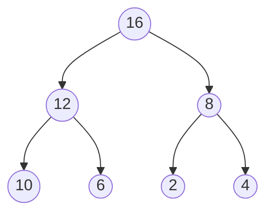
|value|16|12|8|10|6|2|4|18|20|28|30|
|--|--|--|--|--|--|--|--|--|--|--|--|
|\[ i \]|\[1\]|\[2\]|\[3\]|\[4\]|\[5\]|\[6\]|\[7\]|\[8\]|\[9\]|\[10\]|\[11\]|
2<sup>nd</sup> for loop, i = 6
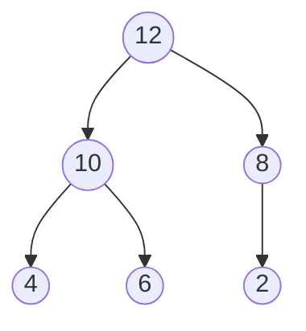
|value|12|10|8|4|6|2|16|18|20|28|30|
|--|--|--|--|--|--|--|--|--|--|--|--|
|\[ i \]|\[1\]|\[2\]|\[3\]|\[4\]|\[5\]|\[6\]|\[7\]|\[8\]|\[9\]|\[10\]|\[11\]|
2<sup>nd</sup> for loop, i = 5
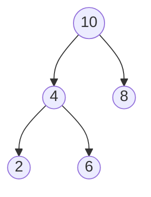
|value|10|4|8|2|6|12|16|18|20|28|30|
|--|--|--|--|--|--|--|--|--|--|--|--|
|\[ i \]|\[1\]|\[2\]|\[3\]|\[4\]|\[5\]|\[6\]|\[7\]|\[8\]|\[9\]|\[10\]|\[11\]|
2<sup>nd</sup> for loop, i = 4
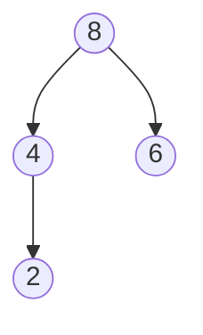
|value|8|4|6|2|10|12|16|18|20|28|30|
|--|--|--|--|--|--|--|--|--|--|--|--|
|\[ i \]|\[1\]|\[2\]|\[3\]|\[4\]|\[5\]|\[6\]|\[7\]|\[8\]|\[9\]|\[10\]|\[11\]|
2<sup>nd</sup> for loop, i = 3
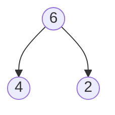
|value|6|4|2|8|10|12|16|18|20|28|30|
|--|--|--|--|--|--|--|--|--|--|--|--|
|\[ i \]|\[1\]|\[2\]|\[3\]|\[4\]|\[5\]|\[6\]|\[7\]|\[8\]|\[9\]|\[10\]|\[11\]|
2<sup>nd</sup> for loop, i = 2
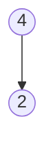
|value|4|2|6|8|10|12|16|18|20|28|30|
|--|--|--|--|--|--|--|--|--|--|--|--|
|\[ i \]|\[1\]|\[2\]|\[3\]|\[4\]|\[5\]|\[6\]|\[7\]|\[8\]|\[9\]|\[10\]|\[11\]|
2<sup>nd</sup> for loop, i = 1

|value|2|4|6|8|10|12|16|18|20|28|30|
|--|--|--|--|--|--|--|--|--|--|--|--|
|\[ i \]|\[1\]|\[2\]|\[3\]|\[4\]|\[5\]|\[6\]|\[7\]|\[8\]|\[9\]|\[10\]|\[11\]|
Thus is the final result