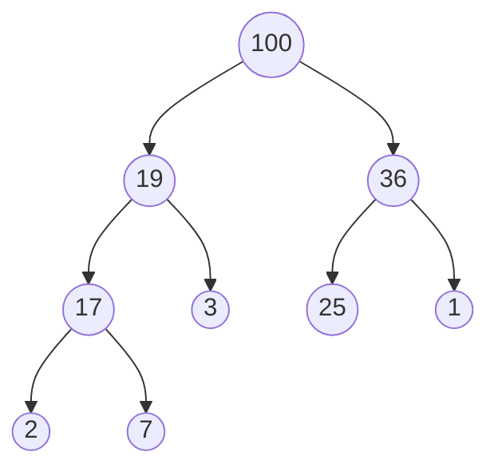

堆積
* Often used to **implenment [[Priorty Queue]]**(優先權佇列)
* can represent using **binary tree** --> Heap
* The element to be ==deleted== is the one with **highest/lowest priorty**

##### Example of max heap

#### Analysis of Max Heap
* **IsEmpty** 直接檢查是否有root --> $O(1)$
* **Top** 找出最大值,最大值就是root --> $O(1)$
* **Pop**拿出最大值之後，再把root補滿
* **Push**插入一個值