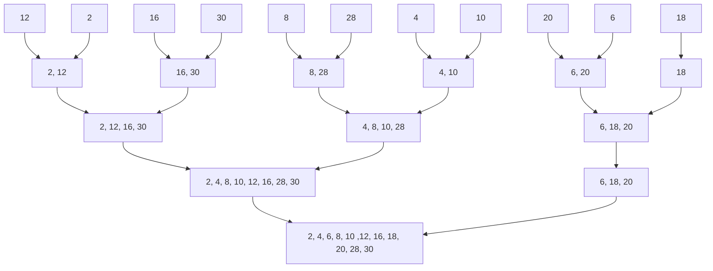

We first consider [[Merge]] two sorted lists to get a single sorted list. (先了解一下怎樣合併兩個排序過的序列)

<table style="font-family: Arial, Helvetica, sans-serif;border-collapse: collapse;width: 100%;">
	<tr style="border: 2px solid #362c28;padding: 6px;">
		<th style="background-color: #f3c969; color: #362c28; text-align: center; padding-top: 12px; padding-bottom: 12px;">1 : m</th><th style="background-color: #fff5b2; color: #362c28; text-align: center; padding-top: 12px; padding-bottom: 12px;">m+1 : n</th>
	</tr>
	<tr style="border: 0px; padding: 6px;">            
		<th style="border: 0px; color: #362c28; text-align: center; padding-top: 12px; padding-bottom: 12px;"></th><th style="border: 0px; color: #362c28; text-align: center; padding-top: 12px; padding-bottom: 12px;"></th>
	</tr>
	<tr style="background-color: #d4fcc3;border: 2px solid #362c28;padding: 6px;">
		<th colspan="2" style="color: #362c28; text-align: center; padding-top: 12px; padding-bottom: 12px;">1 : n</th>
	</tr>
</table>

Code(Template version) :
```cpp
template <class T>
void Merge(T*initList, T*mergedList, const int l, const int m, const int n){
	// initList[l:m] 與initList[m+ 1:n] 是排序好的串列。
	// 我們將它們合併成排序好的串列mergedList[l:n]。
	for(int i1 = l, iResult= l, i2 = m + 1; i1 <= m && i2 <= n; iResult++)
	// i1, i2, 與iResult是串列位置
	// 兩個輸入串列都還沒用盡
		if (initList[i1] <= initList[i2]) {
			mergedList[iResult] = initList[i1];i1++;
		} else {
			mergedList[iResult] = initList[i2];i2++;
		}
	}
	// 如果第一個串列有剩下的記錄，那麼把它複製完
	copy (initList + i1, initList + m + 1, mergedList + iResult);
	// 如果第二個串列有剩下的記錄，那麼把它複製完
	copy(initList + i2, initList + n + 1, mergedList + iResult);
}
```

### [[Analysis of Merge]]
Time Complexiety : $O(s(n-l+1))$ with record size s, or can say $O(n)$ if sorted List is from \[i:n\]
Space Complexiety : $n-l+1$ record space 

## Merge Sort
Divide the Pronblem using [[#Merge Pass]], Passing groups from L<sub>n</sub> to L<sub>n+1</sub>, which wil reduce the numbers of groups in half, as group size \*2, using [[Merge]], as figure below.
```mermaid
graph TD
subgraph merge pass, which passing from Ln->Ln+1 is called
	26 --> L2_1[5, 26]
	5 --> L2_1
	77 --> L2_2[1, 77]
	1 --> L2_2
	61 --> L2_3[11, 61]
	11 --> L2_3
	59 --> L2_4[15, 59]
	15 --> L2_4
	48 --> L2_5[19, 48]
	19 --> L2_5
	subgraph L1, N, size = 1
		26
		5
		77
		1
		61
		11
		59
		15
		48
		19
	end
	subgraph L2, N/2, size = 2
	L2_1
	L2_2
	L2_3
	L2_4
	L2_5
	end
end
subgraph L3, N/4, size = 4
	L3_1
	L3_2
	L3_3
end
%% layer 2-3
L2_1 --> L3_1[1, 5, 26, 77]
L2_2 --> L3_1
L2_3 --> L3_2[11, 15, 59, 61]
L2_4 --> L3_2
L2_5 --> L3_3[19, 48]
%% layer 3-4
L3_1 --> L4_1[1, 5, 11, 15, 26, 59, 61, 77]
L3_2 --> L4_1
L3_3 --> L4_2[19, 48]
%% layer 4-5
L4_1 --> L5[1, 5, 11, 15, 19, 26, 48, 59, 61, 77]
L4_2 --> L5
subgraph L4, N/8, size = 8
	L4_1
	L4_2
end
subgraph L5, N/16, size = 16
	L5
end
```

## Merge Pass
```cpp
template <class T>
// 將大小為s的相鄰子串列對從initList合併至resultList。
// n是initList裡的記錄個數。
void MergePass(T*initList, T*resultList, const int n, const int s) {
	int i;
	for (i = 1; i<= n-2*s+1; i += 2*s)
		Merge(initList, resultList,i, i + s-1,i + 2 * s-1);
		
	// 合併其餘大小< 2 *s的串列
	if ((i + s-1) < n)
		Merge(initList, resultList, i,i+ s-1, n);
	else
		copy(initList+i, initList+ n+ 1, resultList+ i);
}
```

## Merge Sort
```cpp
template <class T>
// 將陣列a[1:n] 排序成非遞減順序
void MergeSort(T*a, const int n) {
	T*tempList = new T[n+1];
	// l是目前合併中的子串列之長度
	for (int l=1; l < n; l *= 2) {
		// 交換a與tempList的角色
		MergePass(a, tempList, n,l);
		l*=2;
		MergePass(tempList, a, n, l);
	}
	delete [] tempList;
}
```

###### Exercise
>Write the status of the list (12, 2, 16, 30, 8, 28, 4, 10, 20, 6, 18) at the end of each phase of MergeSort(Program 7.9)

#### [[Analysis of Merge Sort]]
#### [[Variation-Nature Merge Sort]]

