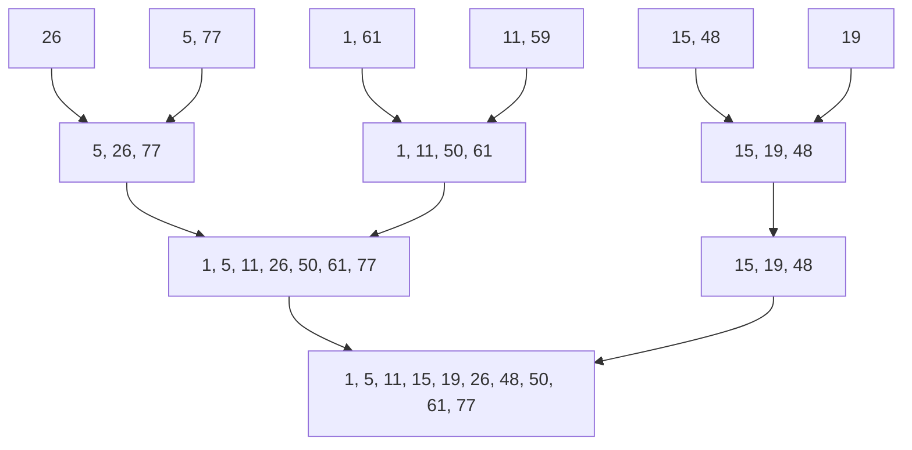

* MergeSort could be modified to take into account the prevailing order within the input list
* To determine the sublists of record that are **in order already**
* Merge sort then uses these initially ordered sublist for the remainder of the passes

